# <h1 style="text-align: center;color:lightblue;">POC 2 - Métodos de Array</h1>

Para explicar os conceitos dos métodos de Array, optei por seguir uma linha de raciocínio como um relatório de estoque.

Para isso criei o seguinte array de Objects:
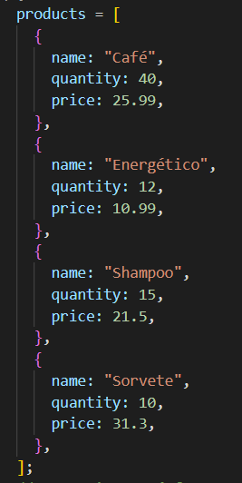

Os dados desse array serão usados para demonstrar todos os métodos requisitados dessa POC.

Para facilitar comparações dos valores, criei uma tabela inicial com apenas esses dados no arquivo index.html

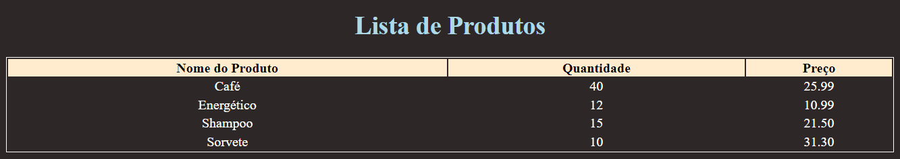

### Spread

### Descrição:

O operador spread é usado para expandir um objeto iterável, como array ou atributos de um objeto. Por exemplo

Para usar basta apenas colocar < ... > antes de um objeto ou array, como o exemplo abaixo. 

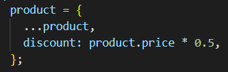

        Alguns casos de uso:

- Usar spread para extrair um dado específico de um array

- Adicionar ou sobrescrever atributos de um objeto

O exemplo que usei de spread é adicionar um campo de desconto na tabela de produtos, como o código abaixo:

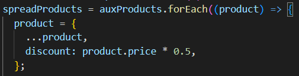

Que resulta na tabela:

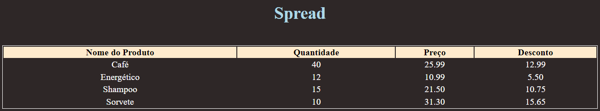

### Map

### Descrição:

O método map() é responsável por mapear os valores de um array baseado em uma função.  
Para demonstrar chamei o método map() para substituir o valor do preço com o valor de retorno de uma função aplica 50% de desconto no produto.

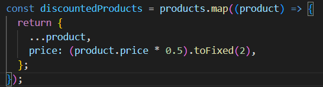

Resultando na tabela:

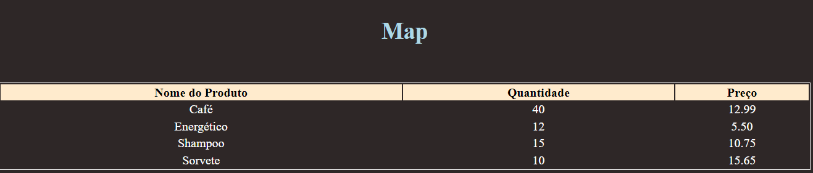

### Pontos Importantes:

- Cria um novo array com o resultado de uma função
- Não executa a função em elementos vazios
- Não modifica o array original

### Reduce

### Descrição:

    O método reduce() é responsável executar uma função em cada elemento do array e reduzi-lo em apenas um valor. 
    Para exemplificar, reduzi a lista de produtos em apenas um campo que simboliza o faturamento no código abaixo:
 

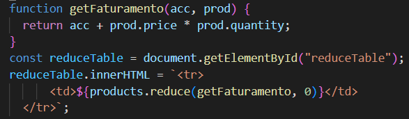

Gerando a tabela:

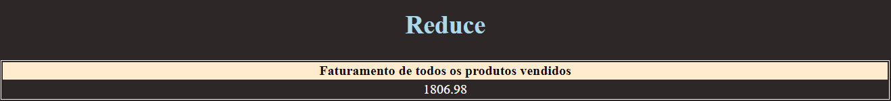

### Pontos Importantes:

- Ao usar reduce, ele executa a função em todos os elementos do array
- A função deve retornar apenas um único valor
- Não executa a função em elementos vazios
- O método reduce não modifica o array original

### Filter

### Descrição:

    Para usar o método filter() você precisa de uma função que retorna valores baseado em alguma condição, assim filtrando o array.  
    Para exemplificar filtrei apenas os objetos com menos de 15 quantidades no estoque. Como demonstra o código abaixo:

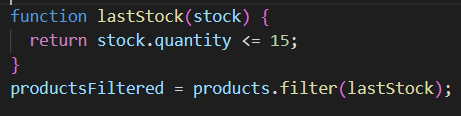

Gerando a tabela:

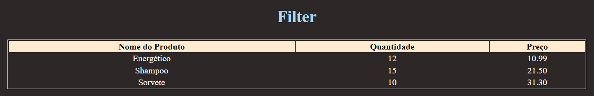

### Pontos Importantes:

- Cria um novo array com os elementos retornados pela função
- Não executa a função em elementos vazios
- Não modifica o array original

### Sort

### Descrição: 
 

    O método sort é responsável por ordenar os elementos de um array baseado em uma função de ordenação onde deve retornar um número positivo, negativo ou 0.

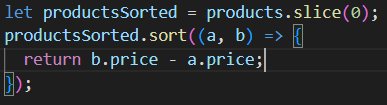

    
    No caso do código eu quis ordenar os produtos por preço de ordem decrescente, para isso usei o 2° parametro - o 1° parâmetro, porque ele apareceria primeiro na lista ordenada. Resultando na tabela:

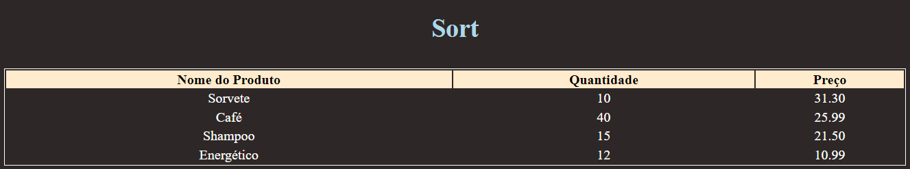

